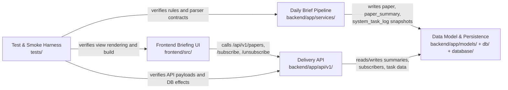
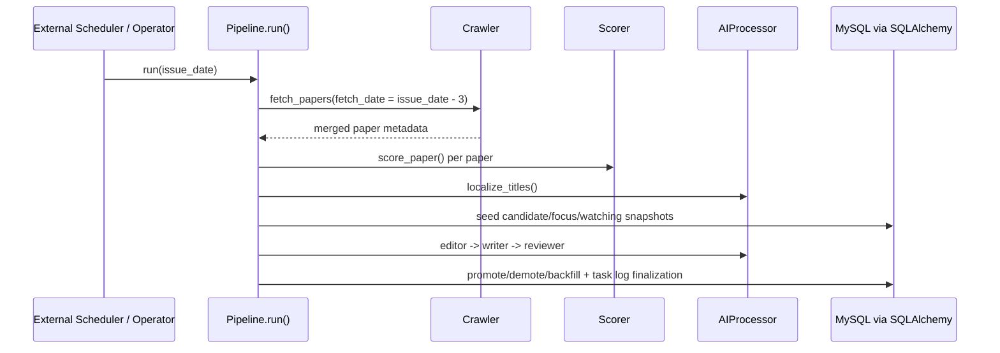

> generated_by: nexus-mapper v2
> verified_at: 2026-03-25
> provenance: System boundaries are AST-backed at the module level; Vue dependencies and several backend internal edges were manually verified from import statements and route wiring because AST impact resolution is partial for `app.*` imports.

# Dependencies

## System Graph

## Pipeline Sequence

## Verified Dependency Notes

- `frontend/src/api/papers.js` is the single frontend API adapter. All current views call it instead of reaching Axios directly.
- `frontend/src/utils/request.js` enforces the custom envelope (`code/msg/data`) and centralizes error messaging.
- `backend/app/api/v1/papers.py` and `backend/app/api/v1/subscribe.py` both depend on `get_db()` and ORM models, making `Data Model & Persistence` the narrow waist of the backend.
- `backend/app/services/pipeline.py` is the only code path that coordinates `Crawler`, `Scorer`, `AIProcessor`, `SessionLocal`, and `SystemTaskLog`.
- `backend/scripts/backfill_title_zh.py` is a sidecar maintenance path that depends on the same DB + `AIProcessor` pair as the main pipeline.

## Dependency Caveats

- The AST tool emits Python module IDs as `backend.app.*`, but the source files import `app.*`; because of this mismatch, automated `--impact` output under-reports backend internal fan-in/fan-out.
- Vue files have module-only AST coverage, so frontend dependency notes were established by direct inspection of `router/index.js`, `App.vue`, and each `views/*.vue` import list.

## Co-change Signals

- `frontend/src/views/Home.vue` <-> `frontend/src/views/Detail.vue` has coupling score `1.0`. Treat feed/detail copy, field display, and category semantics as a shared UX boundary.
- `backend/app/api/v1/papers.py` co-changes with `subscribe.py`, `domain.py`, `schemas/paper.py`, `ai_processor.py`, `crawler.py`, and `pipeline.py` in the current 15-commit history. This suggests payload/schema changes often ripple through API, persistence, and generation logic together.
- Because commit history is still small (15 commits, 1 author), use these co-change edges as prioritization hints rather than definitive architectural truth.
